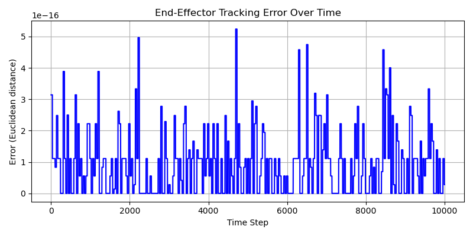
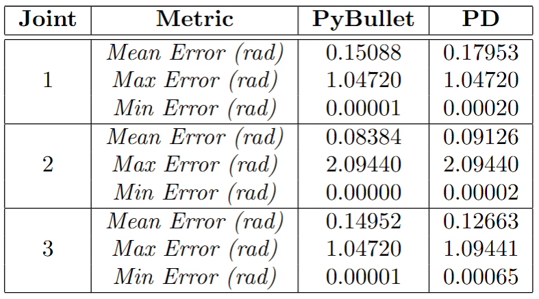
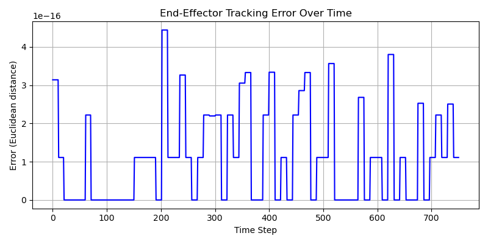
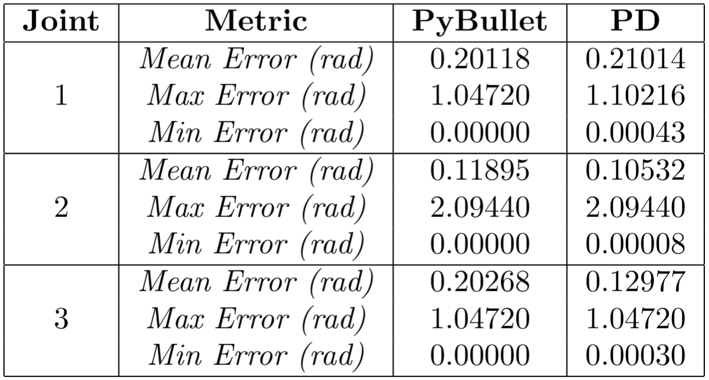
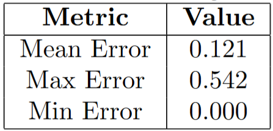
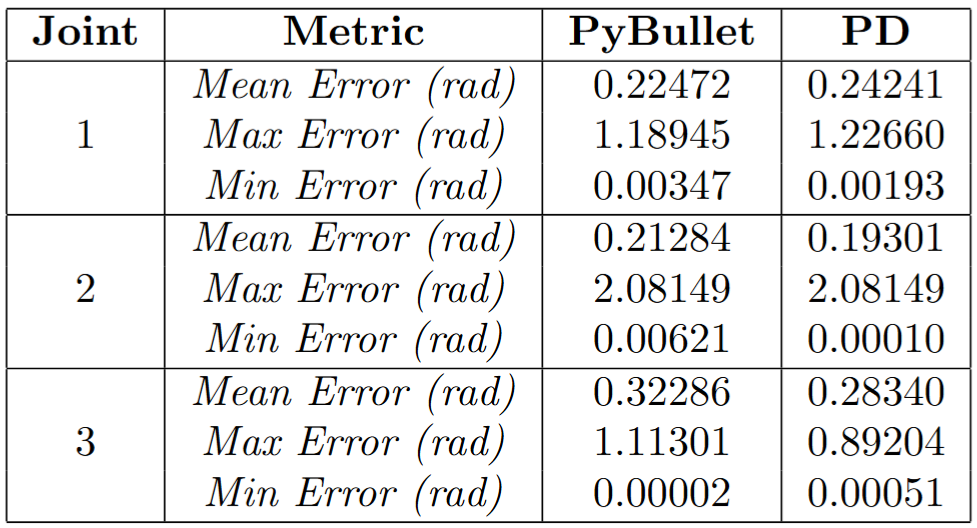
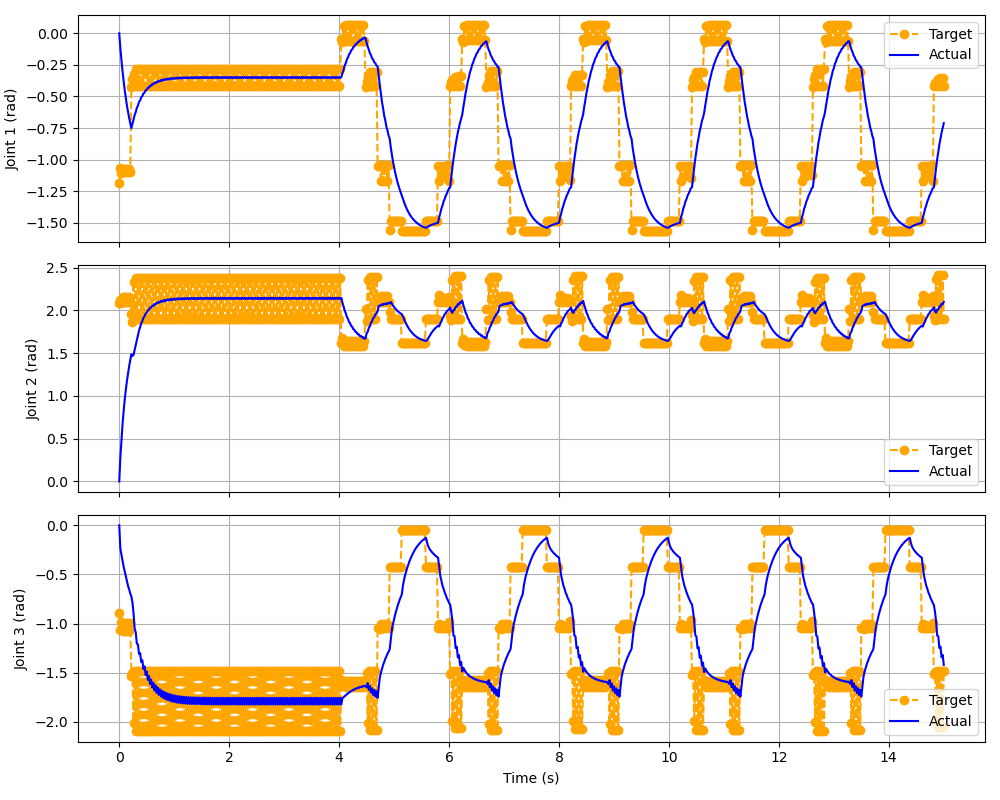
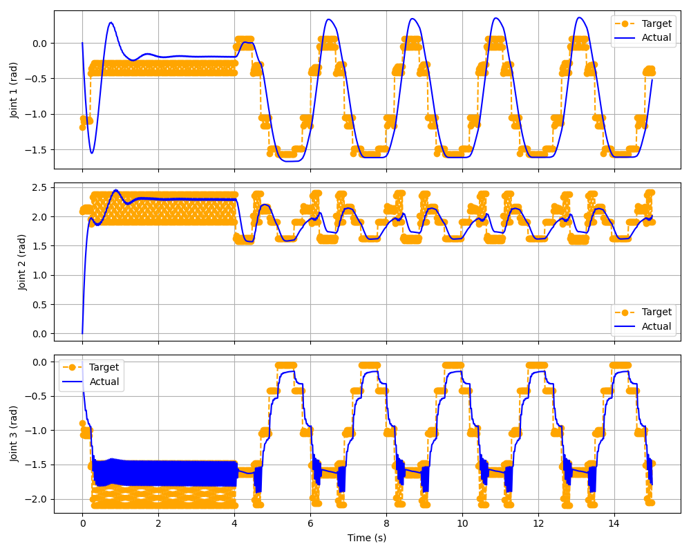

# 🦾 RRR Robot Challenge – PyBullet Simulation

This project tackles a robotics challenge focused on controlling a planar 3-DOF (RRR) robot arm to track a moving 2D target, with increasing complexity across three tasks. We implemented and compared two types of controllers while incorporating obstacle avoidance and joint limit enforcement.

---

## 🚀 Challenge Overview

The goal is to:
- Control a 3-joint revolute (RRR) planar robot arm.
- Track a moving target in the 2D XY plane.
- For the optional task: avoid obstacles and enforce joint limits.

### 🧠 Key Robotics Concepts:
- **Forward and inverse kinematics** for positioning.
- **PD torque control vs PyBullet POSITION_CONTROL** comparison.
- **Obstacle avoidance** using artificial potential fields.
- **URDF robot modelling** and real-time simulation using PyBullet.

We chose **PyBullet** as the simulation environment for its:
- Lightweight and fast simulation capabilities.
- Easy 2D planar setup.
- Built-in physics and visual tools.
- Compatibility with URDF and customizable controllers.

---

## ⚙️ Setup Instructions

### 1. Clone the repository

```bash
git clone https://github.com/lorenzouttini/challenge_humanoid.git
cd challenge_humanoid
```

### 2. Install dependencies

You can either install manually or with `conda`.

#### Using conda:
```bash
conda create -n rrr_challenge python=3.11
conda activate rrr_challenge
pip install -r requirements.txt
```

#### Required packages:
```python
import pybullet as p
import pybullet_data
import time
import numpy as np
import os
import sys
import matplotlib.pyplot as plt
import argparse
```

### 3. Requirements file (`requirements.txt`)

```
pybullet
numpy
matplotlib
```

---

## 🛠 Methodology

### 🔧 Robot Construction & Simulation Parameters

The robot is defined in a URDF file using simple box geometries to build a 3-link RRR robot (`rrr_box_robot.urdf`). It operates in a 2D XY plane with a sinusoidal target. Each link has a unit length (`L = 1.0`), which was chosen for simplicity and to ensure clean kinematic behavior.

Simulations were run for `15 seconds` (`SIM_DURATION = 15.0`), with a control loop running at `1000 Hz` or `50 Hz` (`CONTROL_FREQ`) and the target updated at `30 Hz` or `5 Hz` (`TARGET_FREQ`). These frequencies balance visual clarity, control responsiveness, and simulation speed in a lightweight PyBullet environment.


### 🧮 Controller Design

For each task, we implemented **two controllers**:

#### 🔹 PyBullet Built-in Controller

PyBullet provides a high-level control mode called `POSITION_CONTROL`, which allows you to specify a target joint position for each actuator. Internally, PyBullet handles the torque computation using a built-in Proportional-Derivative (PD) controller. This abstracts away the low-level control logic and makes it easy to command the robot without manually implementing dynamic equations.

This mode works well for applications that prioritize simplicity and stability, especially when working with idealized simulations.

```python
p.setJointMotorControl2(robot_id, i, 
    controlMode=p.POSITION_CONTROL, 
    targetPosition=joint_angles[i])
```

In general, we can state that:
- It is simple to use.
- It provides stable control.
- The customization is quite limited.


#### 🔹 Custom PD Controller

In contrast to the built-in controller, the manual PD controller gives full control over the joint dynamics. You compute the control torques explicitly based on joint position and velocity errors, applying a classic Proportional-Derivative (PD) control law:

```python
τ = Kp * (θ_desired - θ_actual) + Kd * (-θ̇_actual)
```
```python
p.setJointMotorControl2(robot_id, i, 
    controlMode=p.TORQUE_CONTROL, 
    force=torques[i])
```
We tuned the gains manually by assingning `Kp=2550` for all the joints and `Kd=35` for the first two joints and `Kd=30` for the last one. 

By summarizing:
- It offers complete control.
- It requires tuning.
- It validates understanding of joint-space dynamics.

Having both controllers is essential for comparing behavior and validating our approach under different constraints. In the code, the `PyBullet` files refer to the first controller, while the `PD` refer to the second one.

### 🧱 Obstacle Avoidance Strategy

Obstacle avoidance was implemented using **artificial potential fields** (`repulsive_field.py`). Instead of computing repulsive forces only at the end-effector, we evaluated the repulsion from the **midpoints of all robot links**, allowing us to penalize any part of the robot body entering the obstacle's influence zone. This approach better reflects real-world scenarios where **collisions can occur at any joint**, not just at the end-effector.

Repulsive forces are calculated relative to a circular obstacle and projected orthogonally to the robot's motion direction, ensuring the robot slides around the obstacle rather than deviating too aggressively. The strength (`η`) and influence range (`d₀`) of the repulsive force are critical hyperparameters that require careful tuning. Higher values of `η` result in more aggressive avoidance behavior, while `d₀` determines how early the robot begins to react to the obstacle.

Additionally, we adjusted the obstacle position from the original `(X = L, Y = 0.5L)` to a more effective location `(X = 2L, Y = 0.5L)`, ensuring that the obstacle actively interferes with the robot's planned trajectory. This made the task more realistic by simulating a situation in which the robot must intelligently maneuver its entire structure to avoid collision.


### 📦 Supporting Scripts

To maintain a modular and reusable codebase, we implemented a set of general-purpose scripts that handle kinematics, plotting, and simulation utilities:

#### `kinematics.py`
Contains the core functions for both:
- **Forward kinematics** – computes the 2D position of the end-effector based on joint angles.
- **Inverse kinematics** – computes the joint angles needed to reach a target (x, y) position and desired orientation.  
These methods form the basis for both controller types and allow efficient conversion between joint and Cartesian space.

#### `utilities.py`
Includes helper functions used across all tasks:
- `get_target_position(...)` generates a 2D sinusoidal target at fixed frequency.
- `clamp_joint_angles(...)` applies joint limits to ensure safe robot behavior.
- `get_link_midpoints(...)` is used in the optional task to compute the midpoints of each link, necessary for multi-point obstacle avoidance.

#### `plots.py`
Handles all result visualizations:
- Joint angle tracking plots (actual vs target).
- End-effector tracking error over time.
- Saves plots under the `figures/` folder if `--plot` is enabled in the script.

These modules allow each task script to remain clean, focused, and easy to maintain.
"""

---

## ▶️ How to Run

All code is organized under the `src/` folder, divided by task.

Each script supports the following optional flags:

- `--plot`: Generate and save new tracking plots in the folder `src/task{current_task}/figures`.
- `--write`: Save tracking error logs in the file `tracking_errors.txt`.

You can run each script with these flags to regenerate plots or log tracking errors.  
All videos, plots, and result files shown in the next sections have already been generated and are stored in their respective folders (`taskA`, `taskB`, `taskOptional`) and subfolders (`figures`, `plots`).

Once the script runs, the simulation shows up (for about 15 seconds).

### 🧪 Task A: Basic Tracking

```bash
python src/taskA/controller_PD.py
python src/taskA/controller_PyBullet.py
```

### 📈 Task B: Increased Frequency

Same structure as Task A. The only difference is the **target frequency is increased** in the source scripts:
```bash
python src/taskB/controller_PD.py
python src/taskB/controller_PyBullet.py
```

### 🚧 Task C: Obstacle Avoidance + Constraints

This scripts include:
- Repulsive force field from a predefined obstacle
- Joint limit enforcement
- Angle wrapping

```bash
python src/taskC/controllerOpt_PD.py
python src/taskC/controllerOpt_PyBullet.py
```

---

## 📊 Results

### 🧪 Task A: Basic Tracking

In this task, we compare the performance of the robot using two controllers:

- **PyBullet's built-in POSITION_CONTROL**
- **Custom PD (Proportional-Derivative) torque controller**

Both controllers were tested in a high-frequency environment with a control loop of `1000 Hz` and a target update rate of `30 Hz`.


#### 🎥 Simulation Videos


<!-- <div align="center">
  
  <!--  -->
<!-- </div> --> -->

<div align="center">
  <a href="https://github.com/user-attachments/assets/4097543b-b1a3-4236-9058-9c80316c3e5a">
    
  </a>
  <a href="https://github.com/user-attachments/assets/8abf9094-45c6-4d1d-802e-aebbbc05e6d0">
    
  </a>
</div>

*Note: The robot appears very fast due to the high control frequency. You can visually observe that the PyBullet controller tracks the target more tightly, while the PD controller occasionally lags due to dynamics and torque control nuances.*


#### 📈 End-Effector Tracking Error

This figure shows the Euclidean distance between the **end-effector position** (computed via forward kinematics) and the **target** (green dot). The error is calculated using IK/FK, so it is **identical for both controllers**.

<p align="center">
  
</p>

As shown, the error is extremely small — typically on the order of `1e-16`, indicating excellent end-effector accuracy for both methods.

#### 📐 Joint Angle Tracking Error

The following table reports the **tracking error per joint** (difference between target and actual joint angles) for both controllers. This gives a more meaningful comparison, as it reflects how each control method influences the joint-level execution.

<p align="center">

</p>

**Observations:**
- The **PyBullet controller** maintains slightly **tighter control**, especially at joints 1 and 3.
- The **PD controller**, while still performant, shows **higher mean error** on joint 1, likely due to slower convergence of the torque-based dynamics.
- Both methods achieve **milliradian precision**, but the **integrated PyBullet controller is more consistent** at this frequency.


## 📉 Task B: Lower Frequency Tracking

This task evaluates the performance of both controllers when operating at reduced frequencies:

- **Control loop:** 50 Hz  
- **Target update rate:** 5 Hz

The objective is to observe how reduced responsiveness affects both joint accuracy and end-effector tracking.


### 📈 End-Effector Tracking Error

Although the control and target frequencies are much lower than in Task A, the end-effector tracking error (computed from IK and FK) remains extremely small and in the same range (1e-16):

<p align="center">
  
</p>

This is expected because:

- **Inverse Kinematics (IK)** computes the target joint angles from the desired position, regardless of how fast the robot actually moves.  
- **Forward Kinematics (FK)** then reconstructs the theoretical position based on those angles.  

Therefore, the calculated target vs. actual target distance reflects almost no error — it's purely geometric, not dynamic.


### 📐 Joint Angle Tracking Error

Unlike the end-effector, actual joint positions must follow the computed reference over time.  
At lower frequencies, control becomes more challenging, and we observe greater joint tracking error.

<p align="center">
  
</p>

**Observations:**

- Both controllers exhibit higher mean and max joint errors than in Task A.  
- Interestingly, PyBullet’s mean joint 3 error (**0.20268 rad**) is higher than the PD controller, showing that built-in control is not always superior under low-frequency conditions.  
- The general increase in joint error is expected:  
  - **Lower frequency → fewer updates per second**  
  - The robot reacts more slowly to new targets, causing lag between the desired and actual joint angles


### Comparison between TaskA and TaskB results

### 📊 Comparison between Task A and Task B Results

The results from Task A and Task B highlight how crucial the control-to-target frequency ratio is in determining control precision. In Task A, the control loop operated at 1000 Hz while target updates occurred at 30 Hz, resulting in a ratio of approximately **33.3**. This high ratio allowed the system to make frequent control adjustments for each new target, enabling precise joint and end-effector tracking.

In contrast, Task B operated with a much lower control loop frequency of 50 Hz and a target update rate of 5 Hz, yielding a ratio of just **10**. This reduction significantly limited the controller’s ability to respond to changes, leading to increased joint tracking errors. While end-effector errors remained minimal due to the geometric nature of IK and FK computations, the lower responsiveness in Task B directly impacted how well the actual joint positions followed the desired trajectories. Overall, the comparison illustrates that lower control frequencies make the robot’s capacity worse to correct deviations in real time, emphasizing the importance of a high control-to-target ratio for effective tracking.


## 🛑 Task Optional: Obstacle Avoidance & Joint Constraints

In this final task, we extend our control pipeline to handle **obstacle avoidance** and **joint angle wrapping**, introducing additional realism and complexity into the control system.

As mentioned previously, we implemented **Artificial Potential Fields** to enable the robot to avoid a circular obstacle.

- **Repulsive force parameters:**
  - `η = 0.05`: Controls the strength of the repulsive field.
  - `d₀ = L`: Defines the distance of influence for the repulsive force.

To make the avoidance meaningful, we positioned the obstacle at the **same Y-coordinate as the end-effector**, ensuring that the paths would naturally risk collision (`obstacle_center = (2L, 0.5L)` and `obstacle_radius = L/8` ).

Additionally, all **joint angles** are wrapped within the range **[-π, π]** to prevent discontinuities during control and ensure consistency in trajectory planning.

We maintained the **low frequency setup** from Task B:
- `CONTROL_FREQ = 50 Hz`
- `TARGET_FREQ = 5 Hz`

This allows for easier visualization of avoidance behavior and joint correction dynamics.


### 🎥 Simulation Results

| PyBullet Controller | PD Controller |
|---------------------|---------------|
<!-- |  <br> `simulation_PyBullet.mp4` |  <br> `simulation_PD.mp4` | -->

**Observations:**

The **PyBullet controller** demonstrates precise and stable behavior during obstacle avoidance. Throughout the simulation, the end-effector consistently avoids entering the obstacle region, indicating effective repulsive force handling. Furthermore, after bypassing the obstacle, the system quickly and accurately returns to the original target trajectory, maintaining control integrity.

In contrast, the **PD controller**, while exhibiting faster motion along straight segments, shows signs of instability when influenced by the repulsive field. Its ability to recover to the reference trajectory after avoidance is limited, often resulting in prolonged deviation or oscillatory behavior. This suggests that while the PD controller may offer speed advantages in undisturbed motion (because of manual tuning of the gains), its responsiveness is not as reliable under more complex environments.


### 📈 End-Effector Tracking Error (Summary)

<p align="center">
  
</p>

These errors are **significantly higher** than in previous tasks, due to the **intentional displacement** of the end-effector caused by the repulsive field.


### 📐 Joint Angle Tracking Error

<p align="center">
  
</p>

<p align="center">
  
  
</p>

<p align="center">
  <b>Figure:</b> Joint tracking performance for PyBullet (left) and PD (right) controllers.
</p>

These visualizations and the table confirm several key findings regarding the performance of the two controllers:

The **PyBullet** controller exhibits **higher mean joint errors**, particularly in joints 2 and 3, indicating **less accurate tracking** of the reference trajectory overall. However, this comes with a clear advantage: PyBullet demonstrates **lower overshoot across all joints**, which is critical when navigating near obstacles. This suggests that while PyBullet sacrifices some tracking precision, it offers **greater stability and safety** in the presence of repulsive forces.

The **PD controller**, by contrast, achieves **lower mean tracking errors** on all three joints during regular (non-disturbed) motion, confirming its strength in **precise target following** under ideal conditions. However, its **overshoot is consistently higher**, especially on joint 1, which can **compromise obstacle avoidance**. This behavior is also visible in the joint plots, where the PD controller oscillates more aggressively and takes longer to settle after transitions, particularly when influenced by external fields.

In summary, the PyBullet controller prioritizes **safe and stable interaction** with obstacles, while the PD controller emphasizes **accuracy in unconstrained environments**, though at the cost of robustness during avoidance movements.


### 🔍 Tuning `η` (Repulsive Strength)

We experimented with three different values of `η` using the PyBullet controller. We show some *demo videos* to briefly analyze the importance of this parameter in the Artificial Potentail Fields:


As the videos illustrutate, we can state that:

- `η = 0.001`: **Too weak** — the robot frequently **entered the obstacle zone**.
- `η = 0.1`: **Too strong** — caused the robot to become **unstable and overshoot** especially in the starting phase.
- `η = 0.05`: **Balanced** — achieved the **best trade-off** between **safety and trajectory stability**.


---

## 📊 Future Improvements

Possible/potential improvements
- Implement collisions and maybe use a different simulator environment for this (Gazebo or Mujoco)
- Extend the task in 3D dimensions
- Explore more advanced controllers (e.g., MPC)
- Explore more advanced state estimation (e.g., Kalman Filters)


---